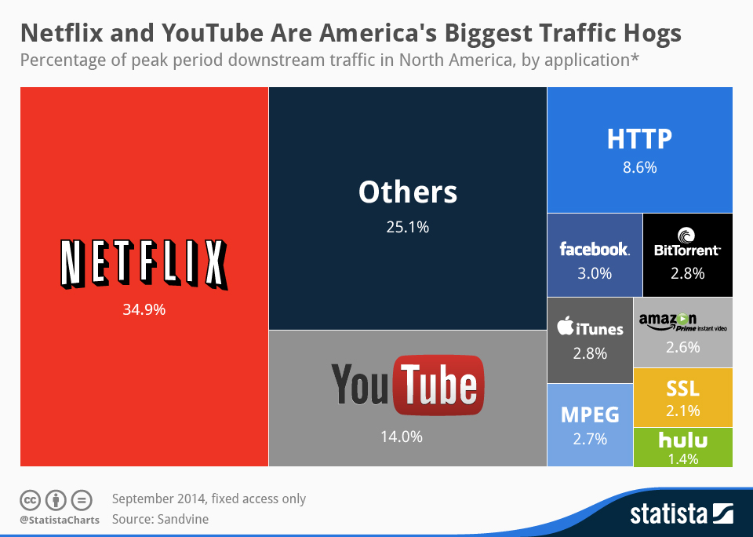

# Asynchronous Coded Caching

## Original Coded Caching Problem

## Asynchronous Coded Caching
While the coded caching scheme introduced by Maddah-Ali and Niesen achieves a significant result, the original formulation of the coded caching problem assumes that the user requests are synchronized, i.e., all file requests from the users arrive at the server at the same time. From a practical perspective, it is important to consider the case when the requests of the users are not synchronized; we refer to this as the asynchronous coded caching problem. 

  

